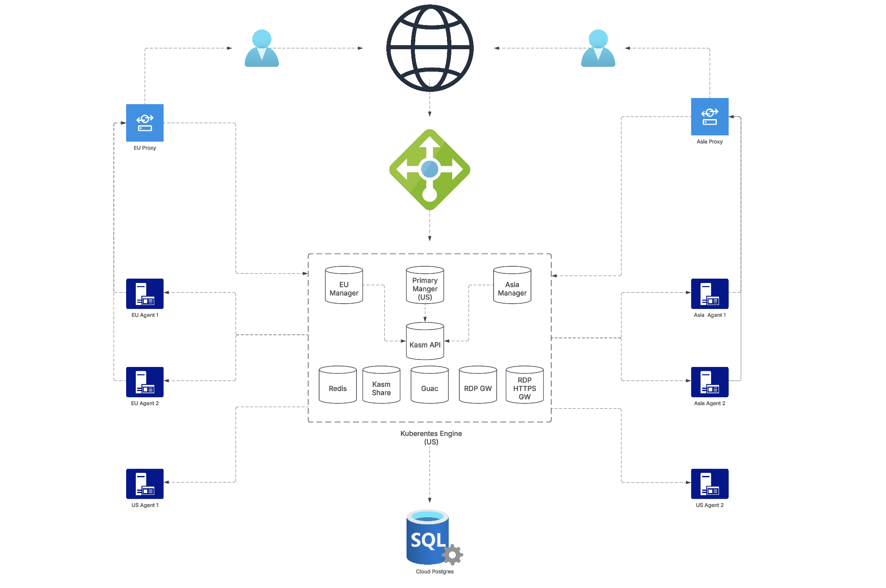

# Kasm Pulumi

This project serves as a starting point for automating Kasm Workspaces deployments using [Pulumi](https://www.pulumi.com/).

## ⚠️ Developer Preview

> **This project is currently in developer preview.**  
> Potential users should be advised that it is suitable for demo and evaluation purposes.

### Features and Architecture
The example scripts provide the capability to deploy a multi-zone Kasm across various cloud providers.

1. **Automated Network Setup**: The entire network stack is automatically configured and provisioned through a Pulumi script, ensuring seamless deployment and infrastructure management.

2. **Cloud-Managed PostgreSQL Database**: A fully managed PostgreSQL database is provisioned in the cloud and integrated with the Kasm control plane for centralized and reliable data management.

3. **Kubernetes Cluster Deployment**: A Kubernetes cluster is set up to host the Kasm control plane, which includes the Kasm Managers for all defined zones.

4. **Agents and Proxies**: Kasm agents and proxies are deployed within virtual machines located in the same cloud region as the corresponding Kasm zone, enabling user sessions to be routed through the nearest available region for enhanced performance and reduced latency.

### Current Supported Cloud Providers
- [GCP](./gcp/README.md): Deploy multi-zone Kasm to your GCP project
- [AWS](./aws/README.md): Deploy multi-zone Kasm to your GCP account