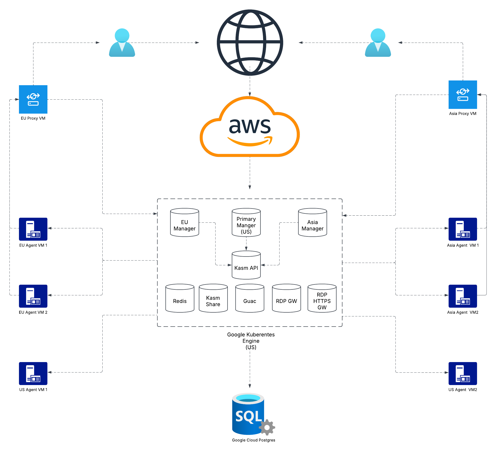

# Kasm AWS Deployment (Python)
This example automates the deployment of a multi-zone Kasm environment on Amazon Web Services (AWS). The script provisions all necessary resources, including networking components, a PostgreSQL database, a Kubernetes cluster, as well as Kasm agents and proxies, enabling seamless and scalable deployment.



## Prerequisites

Before you run the Pulumi script, ensure the following prerequisites are in place:

- **Pulumi**: Install [Pulumi](https://www.pulumi.com/docs/iac/get-started/aws/begin/) to manage your infrastructure as code.
- **Python ≥ 3.12**: Ensure [Python](https://www.python.org/downloads/) 3.12 or higher is installed, along with [pip](https://packaging.python.org/en/latest/guides/installing-using-linux-tools/) and [virtualenv](https://virtualenv.pypa.io/en/latest/installation.html).  If you're having trouble setting up Python on your machine, see [Python 3 Installation & Setup Guide](https://realpython.com/installing-python/) for detailed installation instructions on various operating systems and distributions.
- **AWS CLI**: Install the [AWS CLI](https://docs.aws.amazon.com/cli/latest/userguide/getting-started-install.html) to authenticate and configure your AWS environment.
- **AWS IAM User**: You need an AWS IAM user that has [programmatic access](https://docs.aws.amazon.com/IAM/latest/UserGuide/security-creds-programmatic-access.html) with appropriate permissions to create and manage AWS resources.
  - A list of required IAM permissions can be found [here](docs/AWS_Permissions.md).
- **Domain**: You must own a domain where Kasm will be hosted.  e.g., `kasm.kasm-test.com`.
- **AWS Route 53 Zone**: Ensure you’ve created a Route 53 hosted zone in your AWS account and that your domain’s DNS records are pointed to it. For details, see [AWS](https://docs.aws.amazon.com/Route53/latest/DeveloperGuide/CreatingHostedZone.html).

Additionally, you will need the following information ready before proceeding further:
- **AWS Region**: The AWS region where Kasm will be hosted.
- **Additional Zones**: Whether you’ll deploy extra zones, and if so, their AWS region(s).
- **Agent**: EC2 instance size and count for agents in each Kasm zone.
- **Additional Zone DNS Name**: DNS name for the additional Kasm zone, e.g., `europe.kasm.kasm-test.com`.
- **Additional Zone Proxy DNS Name**: DNS name for the Kasm proxy in the additional zone, e.g., `proxy-europe.kasm.kasm-test.com`.
- **AWS Route 53 Zone ID**: AWS Route 53 Zone ID, e.g. `Z0970401MONU7MKC0BX9`

## Authenticate with AWS
To authenticate with AWS CLI, execute the following commands:
 
```bash
export AWS_ACCESS_KEY_ID="<YOUR_ACCESS_KEY_ID>"
export AWS_SECRET_ACCESS_KEY="<YOUR_SECRET_ACCESS_KEY>"
export AWS_REGION="<YOUR_PRIMARY_KASM_ZONE_AWS_REGION>"
```
Replace `<YOUR_ACCESS_KEY_ID>`, `<YOUR_SECRET_ACCESS_KEY>` and `<YOUR_PRIMARY_KASM_ZONE_AWS_REGION>` with the actual values.

**Note**: If you'd like to permanently save the AWS info, run the following commands:
```bash
echo 'export AWS_ACCESS_KEY_ID="<YOUR_ACCESS_KEY_ID>"' >> ~/.bashrc
echo 'export AWS_SECRET_ACCESS_KEY="<YOUR_SECRET_ACCESS_KEY>"' >> ~/.bashrc
echo 'AWS_REGION="<YOUR_PRIMARY_KASM_ZONE_AWS_REGION>"' >> ~/.bashrc
```

Make sure your AWS CLI is working with the following test command:
```bash
aws sts get-caller-identity
```

You should get the output in the following format:
```bash
{
  "Account": "123456789012", 
  "UserId": "AR#####:#####", 
  "Arn": "arn:aws:sts::123456789012:assumed-role/role-name/role-session-name"
}
```

## Clone Git repo
```bash
git clone https://github.com/kasmtech/kasm-pulumi.git
cd kasm-pulumi/aws
```

## Setup Python Environment
```bash
python3 -m venv venv
source venv/bin/activate
pip install -r requirements.txt
```

> Make sure [Python](https://www.python.org/downloads/) 3.6 or higher is installed on your machine, along with [pip](https://packaging.python.org/en/latest/guides/installing-using-linux-tools/) and [virtualenv](https://virtualenv.pypa.io/en/latest/installation.html).  If you're having trouble setting up Python on your machine, see [Python 3 Installation & Setup Guide](https://realpython.com/installing-python/) for detailed installation instructions on various operating systems and distributions.

## Login Pulumi
If you already have a Pulumi account, simply run the following command:
```bash
pulumi login
```

If you'd prefer to use Pulumi locally (without login), run:

```bash
pulumi login --local
```

## Setup Pulumi Stack
```bash
pulumi stack init dev
cat Pulumi.dev.yaml.example >> Pulumi.dev.yaml
export PULUMI_CONFIG_PASSPHRASE="{PASSPHRASE}"
```
Replace `{PASSPHRASE}` with your actual Pulumi passphrase.
**Note**: If you'd like to permanently save the `PULUMI_CONFIG_PASSPHRASE` environment variable, run the following command:
```bash
echo 'export PULUMI_CONFIG_PASSPHRASE="{PASSPHRASE}"' >> ~/.bashrc
```

## Config Pulumi Stack
Configure the `Pulumi.dev.yaml` file by modifying it as follows:

### kasm-aws:data
- **region**: The AWS region for the primary Kasm zone. This must match the region used in the “Authenticate with AWS” section. _Example_: `us-west-2`
- **availability_zone**: The AWS Availability Zone for the primary Kasm zone. _Example_: `us-west-2a`
- **additional_availability_zone**: A secondary Availability Zone for Multi-AZ high availability (e.g., for RDS and EKS). _Example_: `us-west-2b`
- **vm_enable_ssh**: Set to `true` to add an ingress rule on port 22 for Kasm agent and proxy VMs; otherwise, set to `false`.
- **domain**: The fully qualified domain name for the primary Kasm zone (must be owned by you). _Example_: `kasm.kasm-test.com`
- **agent_size**: The EC2 instance type for Kasm agents in the primary zone. _Example_: `t3.xlarge`
- **agent_number**: The number of Kasm agent instances to deploy in the primary zone. _Example_: `2`
- **agent_disk_size**: The disk size (in GB) for each Kasm agent instance across **all** zones. _Example_: `100`
- **db_instance_class**: The AWS RDS Postgres instance class (e.g., `db.t4g.medium`). We recommend at least 2 vCPUs and 3.75 GB RAM for optimal performance.
- **route_53_zone_id**: The ID of the Route 53 hosted zone to use (domain must already point here). _Example_: `Z0970401MONU7MKC0BX9`

**Note**: You must have created a Route 53 hosted zone and updated your domain’s DNS to point to it. See [AWS documentation](https://docs.aws.amazon.com/Route53/latest/DeveloperGuide/CreatingHostedZone.html) for details. 

### kasm-aws:data.additional_kasm_zone
A list of additional Kasm zones to deploy. If you don’t plan to deploy extra zones, simply remove this section from your Pulumi configuration. Each zone requires its own configuration:

- **name**: A unique identifier for the zone (e.g., `europe`, `asia`).
- **region**:  The AWS region in which this zone will be deployed (e.g., `eu-west-2`). Each additional zone must use a distinct region.
- **availability_zone**: The AWS Availability Zone within the specified region for this zone (e.g., eu-west-2a).
- **additional_availability_zone**: A secondary Availability Zone to enable Multi-AZ high availability (e.g., for an Application Load Balancer). _Example_: `eu-west-2b`
- **proxy_size**: The EC2 instance type for the zone’s proxy server. _Example_: `t3.large`
- **agent_size**: The EC2 instance type for the zone’s agent servers. _Example_: `t3.xlarge`
- **agent_number**: The number of agent instances to deploy in the zone. _Example_: `2`
- **domain**: The fully qualified domain name for this zone (must be a subdomain of your primary Kasm domain). _Example_: `europe.kasm.kasm-test.com`
- **proxy_domain**: The fully qualified domain name for this zone’s proxy server. _Example_: `proxy-europe.kasm.kasm-test.com`

**Note**: We highly recommend using the following DNS structure for a multi-zone Kasm setup:
- Assume Kasm domain is `kasm.kasm-test.com`.
- Additional zone DNS names should be subdomains of the Kasm domain (e.g., `europe.kasm.kasm-test.com`).
- Additional zone proxy DNS names should also be subdomains of the Kasm domain (e.g., `proxy-europe.kasm.kasm-test.com`).


## Pulumi Script Notes
**AWS RDS PostgreSQL Instance Configuration**
- The instance is configured with `allocated_storage = 10` and `max_allocated_storage = 100` by default.
- `deletion_protection` is set to its default value: `False`.
- `skip_final_snapshot` is explicitly set to `False`.
- Automated backups are not enabled by default.

To change any of these settings, edit the `resources/aws_db.py` file. For full parameter details, see the Pulumi AWS RDS Instance [docs](https://www.pulumi.com/registry/packages/aws/api-docs/rds/instance/).


## Execute Pulumi Script
Once you’ve finished configuring the Pulumi stack, run the following command to start the deployment. Depending on the resources being provisioned, this may take 20–30 minutes.

```bash
pulumi up --stack dev
```

**Note 1**: As mentioned in the Prerequisites, before running this command, ensure your domain is pointed to the appropriate Route 53 hosted zone.
**Note 2**: After the Pulumi script completes, AWS may take up to 15 minutes to provision the ingress load balancer. Kasm will only become accessible once the load balancer is fully created.

## (Optional) Accessing Your EKS Cluster with kubectl
After deployment finishes, you can connect to your EKS cluster using `kubectl`.

### Install kubectl
If you haven't installed `kubectl` yet, you can follow the instructions in this AWS [documentation](https://docs.aws.amazon.com/eks/latest/userguide/install-kubectl.html#_step_2_install_or_update_kubectl) to install it.

### Retrieve Cluster Credentials
Run the following command to retrieve the credentials for your EKS cluster:
```bash
export KUBECONFIG=$(mktemp)
pulumi stack output --show-secrets kubeconfig > "$KUBECONFIG"
```

### Verify Cluster Access
Test connectivity by listing pods in the kasm namespace:

```bash
kubectl -n kasm get pods
```

## Login Kasm
Once you run the Pulumi script, you should be able to access the Kasm admin console at https://{domain}.

To get the login credentials, execute the command `pulumi stack output --show-secrets --stack dev`, and use the values of `Kasm Admin User` and `Kasm Admin Password`

## Install a Kasm Workspace
In the Kasm admin console, select **Workspaces > Registry** and choose the workspace image you would like to install.

*Note: The agent may take a few minutes to download the selected workspace image before a session can be started.*

## Start A Kasm Session
Navigate to the **WORKSPACES** tab at the top of the page and start your first Kasm session once the workspace image is ready!

## (Optional) Enable Kasm Autoscaler
Kasm has the ability to automatically provision and destroy agents based on user demand. The overall goal of the features is to ensure Staged Sessions are created, any additional hot spare compute resources (e.g agents) are always available to support on-demand Kasm sessions, and to reduce costs by destroying those resources when no longer needed. 

The Kasm Autoscale configurations are included as part of the Pulumi deployment but is disabled by default. To enable it, you will need to manually input IAM user's AWS access key ID and secret access key with the following permission attached (alternatively, you can use the same IAM account as the one Pulumi/AWS CLI is using):
- **`AmazonEC2FullAccess`**


### Steps to Enable the Kasm Autoscaler:
1. **Access the Kasm Admin UI**:  
   In the Kasm Admin UI, navigate to **Infrastructure** → **Pools** → **All VM Provider Configs**.
2. **Edit the Desired Zone**:  
   Select the zone where you wish to enable the Kasm Autoscaler and click **Edit**.
3. **Add AWS Access Key ID and Secret Access Key**:  
   Copy your **AWS Access Key ID** and **Secret Access Key** into the corresponding fields.
4. **Configure Optional Settings (if needed)**  
   If the default values don't meet your requirements, adjust the following options:
    - **Max Instances**
    - **Machine Type**
    - **Boot Volume GB**

   For full details on all available configuration options, refer to the [Kasm Documentation](https://kasmweb.com/docs/latest/guide/zones/aws_autoscaling.html#aws-settings).
5. **Save Your Changes**:  
   After reviewing your settings, click **Submit** to save the changes.
6. **Navigate to AutoScale Configs**:  
   Next, go to **Infrastructure** → **Pools** → **All AutoScale Configs**.
7. **Edit the AutoScale Configuration**:  
   Select and **Edit** the AutoScale configuration you wish to enable. Ensure this is the same VM Provider zone to which you previously added your AWS access Key ID and Secret Access Key.
8. **Enable the Autoscaler**:  
   Toggle the **Enabled** option to activate the Autoscaler.
9. **Configure Additional Settings (if necessary)**  
   Modify the following optional settings:
    - **Standby Cores**
    - **Standby GPUs**
    - **Standby Memory**
    - **Agent Cores Override**
    - **Agent GPUs Override**
    - **Agent Memory Override**

   For more information on these options, consult the [Kasm Documentation](https://kasmweb.com/docs/latest/guide/zones/aws_autoscaling.html#general-settings).
10. **Finalize the Configuration**:  
    Click **Next** and then **Finish** to apply the changes.

## Created Pulumi Resources
### AWS Networking
The table below provides an overview of the AWS network-related resources that are created:

| **Resource Type**                                                      | **Description**                                                                                                          |
|------------------------------------------------------------------------|--------------------------------------------------------------------------------------------------------------------------|
| **VPC**                                                                | A Virtual Private Cloud to host all compute and networking resources. One VPC per Kasm zone.                             |
| **Subnet**                                                             | Public and private subnets for each zone to support Multi-AZ deployments (e.g., RDS, EKS).                               |
| **Elastic IP, Internet Gateway, NAT Gateway**                          | Provide outbound internet connectivity for public and private subnets.                                                   |
| **Route Table, Routing Rule, Route Table Association, Security Group** | Define traffic flow rules within and between subnets, including NAT/IGW routing and multi-zone peering.                  |
| **Subnet Group**                                                       | RDS subnet group for deploying database instances across private subnets in multiple Availability Zones.                 |
| **Route 53 DNS Zone**                                                  | A private hosted zone for internal DNS resolution of the RDS PostgreSQL instance.                                        |
| **Certificate**                                                        | SSL certificates provisioned via AWS Certificate Manager (ACM) to secure traffic to the Application Load Balancers.      |
| **Route 53 DNS Records**                                               | Records in your hosted zone used for ACM validation and resolving ingress ALB and proxy endpoints.                       |
| **VPC Peering Connection**                                             | Peering connections and route entries to enable secure cross-VPC communication between primary and additional zones.     |
| **Application Load Balancer (ALB), Target Group, Listener**            | ALBs in each zone route user traffic to Kasm proxy endpoints via Target Groups; Listeners define request handling rules. |


### Other AWS Resources
The table below provides an overview of the AWS resources that are created, which are not part of the previous table:

| **Resource Type**                    | **Description**                                                                          |
|--------------------------------------|------------------------------------------------------------------------------------------|
| **RDS Parameter Group**              | Custom parameter group defining runtime settings for the PostgreSQL instance.            |
| **RDS Instance**                     | Fully managed Amazon RDS PostgreSQL database for Kasm.                                   |
| **EKS Cluster**                      | AWS Elastic Kubernetes Service cluster for deploying and managing the Kasm Helm chart.   |
| **EC2 Key Pair**                     | SSH key pair used to access agent and proxy EC2 instances.                               |
| **EC2 Network Interface & Instance** | EC2 instances (agents and proxies) and their network interfaces.                         |


### No AWS Resources
The table below provides an overview of the no-AWS resources that are created:

| **Resource Type**           | **Description**                                                                    |
|-----------------------------|------------------------------------------------------------------------------------|
| **Kubernetes Provider**     | Pulumi Kubernetes provider configured to interact with the EKS cluster.            |
| **Ingress Class**           | Defines the ingress controller for routing external traffic into the cluster.      |
| **Storage Class**           | Defines how dynamic volume provisioning (PVCs) should behave.                      |
| **Helm Release**            | The Kasm Helm chart deployed into the EKS cluster to run Kasm services.            |
| **Kubernetes Job**          | Job for post-deployment tasks, such as enabling Kasm agents and final setup steps. |


## Delete Pulumi Stack
To delete the created Pulumi stack along with all the associated resources, run the following command:

```bash
pulumi down --stack dev
```
